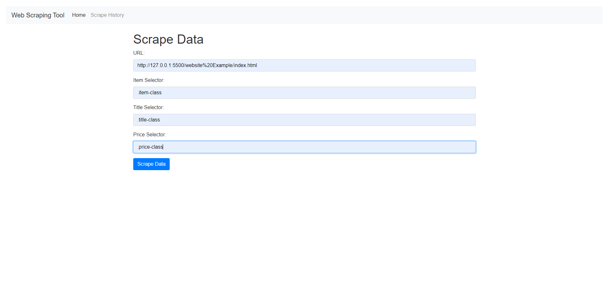
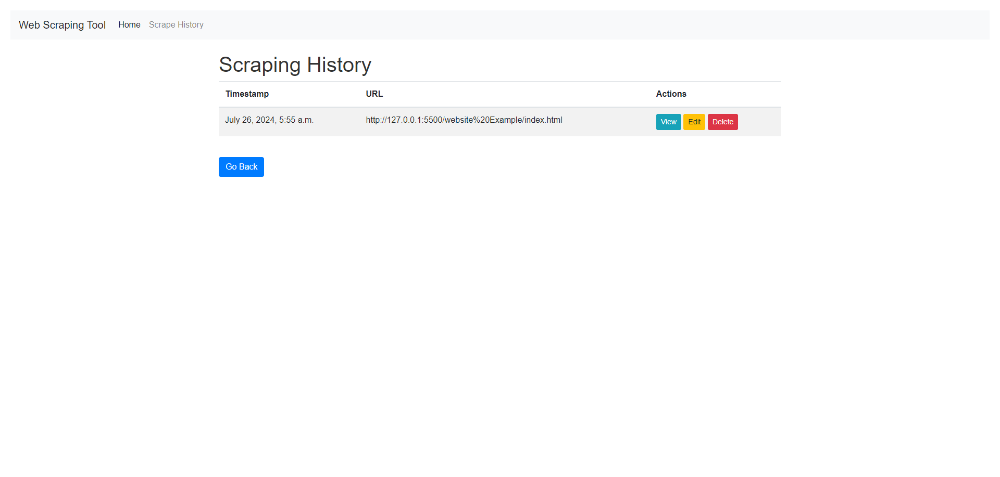
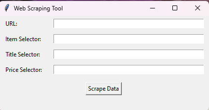
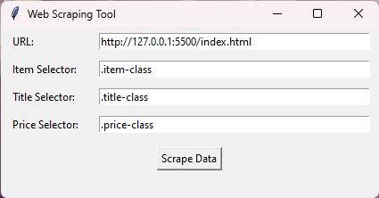
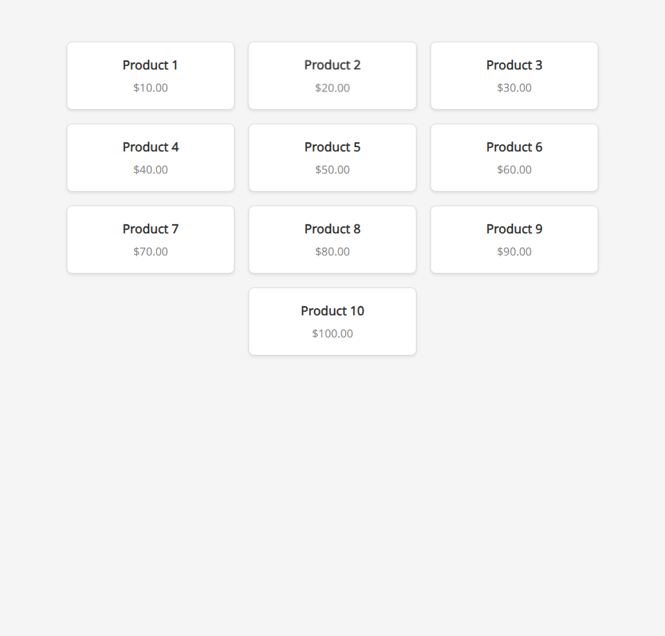
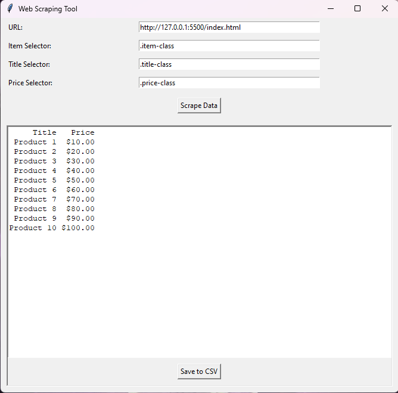
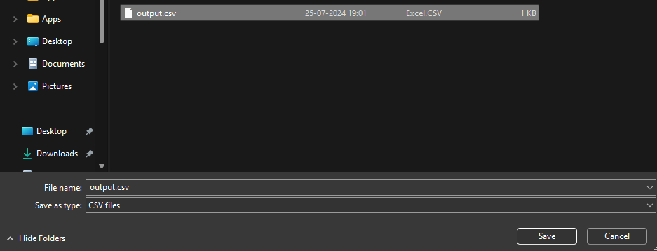
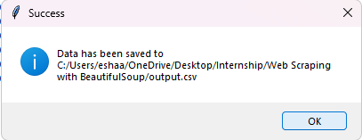

# Web Scraping Tool with GUI

This project is a simple web scraping tool with a graphical user interface (GUI) built using Tkinter. It allows users to input a URL and CSS selectors for the data they want to scrape, displays the scraped data, and provides an option to export it to a CSV file.

# Here is the Version 2 of this project( using Django and database )

[Version 2](https://github.com/EshaanManchanda/Web-Scraping-Tool/tree/version-2)

## Home Page


## History Page


## Features

- Input URL and CSS selectors for the data to scrape.
- Display scraped data in the GUI.
- Export scraped data to a CSV file.
- User-friendly interface built with Tkinter.

## Requirements

- Python 3.x
- `requests` library
- `beautifulsoup4` library
- `pandas` library
- `tkinter` (comes pre-installed with Python)

## Installation

1. Clone the repository:
   ```bash
   git clone https://github.com/EshaanManchanda/Web-Scraping-Tool.git
   cd web-scraping-tool

2. Install the required libraries:

```bash
pip install requests beautifulsoup4 pandas 

```
or

```bash
pip install -r requirements.txt
```
## Usage

Run the script:

```bash
python web_scraping_tool.py
```

1. Enter the URL and CSS selectors in the respective fields.

2. Click the "Scrape Data" button to start scraping.

3. View the scraped data in the application.

4. Click the "Save to CSV" button to export the data to a CSV file.

# Screenshots
1. Main Interface





2. Extract Data from website





3. Save page



4. Success Message




## Scraped Data

# Example
Enter the following details:

1. URL: https://example.com
2. Item Selector: .item-class
3. Title Selector: .title-class
4. Price Selector: .price-class
5. Click the "Scrape Data" button.


The application will display the scraped data:


Click the "Save to CSV" button to save the data to output.csv.

