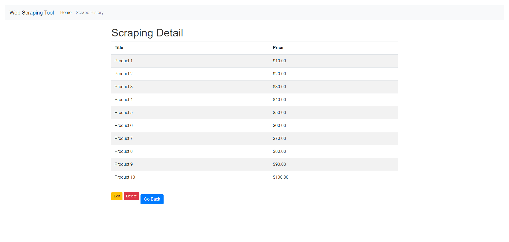

# Web Scraping Tool with Django

This project is a web scraping tool built using Django. It allows users to scrape data from websites and store the results in a database. The tool also provides a history of previous scraping operations and supports CRUD operations for the scraping history. Additionally, users can export the scraped data to a CSV file.

## Features

- **Web Scraping**: Extract data from websites using BeautifulSoup.
- **Database Storage**: Store scraped data and history in a database.
- **CRUD Operations**: Manage scraping history (Create, Read, Update, Delete).
- **Export to CSV**: Export scraped data to a CSV file.
- **Interactive UI**: User-friendly interface using Bootstrap.

## Installation

### Prerequisites

- Python 3.x
- Django 3.x or 4.x
- Bootstrap (for UI)

### Steps

1. Clone the repository:
   ```bash
   git clone https://github.com/EshaanManchanda/web-scraping-tool.git
   cd web-scraping-tool
2. Create a Virtual environment:
```bash
python -m venv venv
```

## for linux
```bash
source venv/bin/activate  # On Windows, use `venv\Scripts\activate`
```

## for windows
```bash
venv/scripts/activate
```
3. Install the required packages:
```bash
pip install -r requirements.txt
```
4. Apply Migrations:
```bash
python manage.py migrate
```

5. Run the development:
```bash
python manage.py runserver
```
6. Open your browser and navigate to http://127.0.0.1:8000/.


# Usage

## Scraping Data

1. Fill in the form on the main page with the URL and CSS selectors for the items you want to scrape.

2. Click the "Scrape" button to start the scraping process.

3. The results will be displayed in a table on the results page, and they will be saved to the database.

## Viewing History

1. Navigate to the history page to see a list of previous scraping operations.

2. Click on an entry to view the details of that scraping operation.

## CRUD Operations

1. Update: On the detail page, you can update the selectors and URL.
2. Delete: On the detail page, you can delete the entry.
3. Create: Fill out the form on the main page and submit to create a new entry.

## Exporting Data
1. On the results page, click the "Export to CSV" button to download the scraped data as a CSV file.

# Screenshots

## Home Page


## Results Page


## Export Page


## History Page


## Detail Page


## Delete Page


## Example website page


# Acknowledgements

1. Django
2. BeautifulSoup
3. Bootstrap